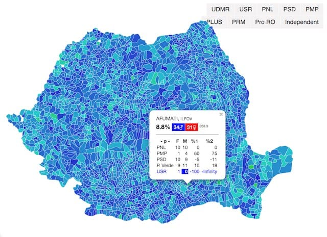

Genul probabil al numelor proprii românești 1

Verifică ultimul nume din coloana `<name_col_name>` după o listă de excepții 2 (nume de fete care nu se termină în 'A' și nume băieți care se termină în 'A'), dacă nu e o excepție, decide după ultima literă - A/non-A 

usage: `python gender-assumer.py <path/to/input_file.csv> <name_col>`
`<name_col>` - indexul coloanei din care se ghicește genul

output csv: `<path/to>/gender-assumed/<input_file>+gen.csv`

[1] Întru verificarea respectării regulii de reprezentare a ambelor sexe pe listele electorale ([Legea 115/2015](http://legislatie.just.ro/Public/DetaliiDocument/168136#id_artA49), [Legea 208/2015](http://legislatie.just.ro/Public/DetaliiDocument/170037#id_artA489_bdy))

> Listele de candidați pentru alegerea consiliilor locale și a consiliilor județene / senatorilor şi deputaţilor trebuie întocmite astfel încât să asigure reprezentarea ambelor sexe, cu excepția acelora care conțin un singur candidat. 

[2] sursă: [BEC 2016](http://2016bec.ro/candidati/index.html) 

<mark>**PS.**</mark> Am remarcat ulterior că de fapt exista și [lead-ratings/gender-guesser](https://github.com/lead-ratings/gender-guesser) (internațional, incl RO)

---

Derivative works:

- [Alegeri locale septembrie 2020 - prezenta femeilor pe listele partidelor si aliantelor politice](https://public.tableau.com/profile/raul2984#!/vizhome/Alegerilocaleseptembrie2020-prezentafemeilorpelistelepartidelor/Dashboard12) (Tableau Dashboard)
- [Alegeri cu liste de candidați la consiliul local care încalcă legea](https://expertforum.ro/liste-candidati-ilegale/) - Analiză
- [Sexul candidaților](https://pax.github.io/playground/sexul-candidatilor/#) (hartă Leaflet, WIP, buggy)

 

---

<meta property="og:image" content="https://raw.githubusercontent.com/pax/ro-gender-assumer/master/sexul-candidatilor.jpg" />
